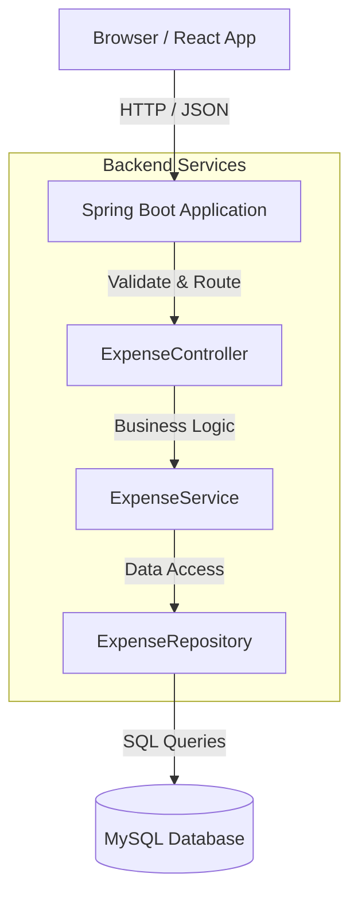

# High-Level Design (HLD)

## 1. System Architecture

The application follows a monolithic 3-tier architecture, designed for simplicity and potential future extensibility.

### 1.1 Technical Components

| Component | Technology | Description |
|-----------|------------|-------------|
| **Frontend** | React (Vite) | Single Page Application (SPA) for user interaction. |
| **Backend** | Spring Boot (Java 17+) | REST API for business logic and data persistence. |
| **Database** | MySQL | Relational database for persistent storage. |
| **API** | REST | JSON-based communication. |

### 1.2 Component Diagram



## 2. API Design

### 2.1 POST /expenses
Create a new expense entry.

**Request Body:**
```json
{
  "amount": 120.50,
  "category": "Food",
  "description": "Lunch at cafe",
  "expense_date": "2023-10-27",
  "idempotency_key": "uuid-v4-from-frontend"
}
```

**Response:**
- `201 Created`: Expense created successfully.
- `200 OK`: Idempotent success (duplicate key detected, existing record returned).
- `400 Bad Request`: Invalid input (negative amount, missing fields).

### 2.2 GET /expenses
Retrieve a list of expenses with optional filtering and sorting.

**Query Parameters:**
- `category` (optional): Filter by category (exact match).
- `sort` (optional): Sort criteria. Default `date_desc`.
    - Supported values: `date_desc`, `date_asc`, `amount_desc`, `amount_asc`.

**Response:**
```json
[
  {
    "id": 1,
    "user_id": 1,
    "amount": 120.50,
    "category": "Food",
    "description": "Lunch at cafe",
    "expense_date": "2023-10-27",
    "created_at": "2023-10-27T12:30:01"
  }
]
```

### 3. Data Model

**Table: `users`**
| Column | Type | Constraints | Description |
|--------|------|-------------|-------------|
| `id` | BIGINT | PRIMARY KEY, AUTO_INCREMENT | Unique user identifier |
| `email` | VARCHAR(255) | UNIQUE, NOT NULL | User's email address |
| `name` | VARCHAR(255) | | User's full name |
| `created_at` | TIMESTAMP | DEFAULT CURRENT_TIMESTAMP | Account creation timestamp |

**Table: `expenses`**
| Column | Type | Constraints | Description |
|--------|------|-------------|-------------|
| `id` | BIGINT | PRIMARY KEY, AUTO_INCREMENT | Unique expense identifier |
| `user_id` | BIGINT | FOREIGN KEY (users.id) | Owner of the expense (Delete Cascade) |
| `amount` | DECIMAL(19,2) | NOT NULL | Monetary value |
| `category` | VARCHAR(100) | NOT NULL, INDEXED | Expense category (e.g., Food, Travel) |
| `description` | TEXT | | Optional details |
| `expense_date` | DATE | NOT NULL, INDEXED | Date of the expense |
| `created_at` | TIMESTAMP | DEFAULT CURRENT_TIMESTAMP | Record creation timestamp |
| `idempotency_key` | VARCHAR(255) | UNIQUE | Key to prevent duplicate submissions |

**indexes**:
- `idx_expense_user` on `user_id`
- `idx_expense_category` on `category`
- `idx_expense_date` on `expense_date`
- `idx_expense_user_date` on `user_id`, `expense_date`


## 5. Frontend Design

### 5.1 Components
-   **ExpenseForm**: Form with validation for Amount (>0), Date (required), and Category. Generates `idempotency_key` on submit.
-   **ExpenseList**: Table displaying expenses. Supports sorting by column headers.
-   **FilterBar**: Dropdown to select category.
-   **SummaryWidget**: Displays "Total: ₹X" based on the currently filtered list.

### 5.2 State Management
-   Uses `React Query` (TanStack Query) or simple `useEffect` + `useState` for data fetching and caching.
-   Optimistic updates can be used for better UX, rolling back on failure.

## 6. Implementation Plan / Trade-offs

-   **Database**: Using MySQL for robust persistence as requested.
-   **Validation**: Basic validation on both frontend (HTML5/JS) and backend (Jakarta Validation).
-   **Security**: Minimal for this assignment (no auth required per specs).
